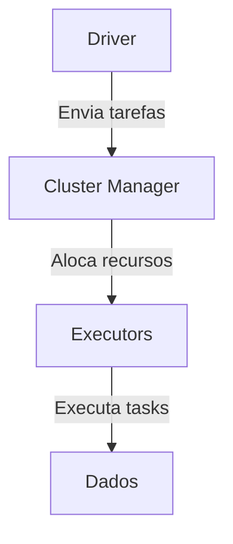

# Fundamentos do Apache Spark

## Introdução

Este documento apresenta uma visão detalhada sobre os fundamentos do Apache Spark, abordando desde o contexto histórico do Big Data até a aplicação prática com exemplos em PySpark. O objetivo é fornecer uma base sólida para quem deseja se especializar em engenharia de dados utilizando Spark, mostrando conceitos, arquitetura, melhores práticas e exemplos de código.

---

## 1. Por que Spark? O Contexto do Big Data

### 1.1. A Evolução do Big Data

O termo Big Data surgiu para descrever o crescimento exponencial dos dados gerados por aplicações, dispositivos e usuários. Esse crescimento trouxe desafios em três principais dimensões, conhecidas como os **3 Vs do Big Data**:

- **Volume**: Quantidade massiva de dados.
- **Variedade**: Diversidade de formatos (estruturados, semi-estruturados, não estruturados).
- **Velocidade**: Rapidez com que os dados são gerados e precisam ser processados.

Com o tempo, outros Vs foram adicionados, como **Veracidade** (qualidade dos dados) e **Valor** (utilidade dos dados).

### 1.2. O Papel do Hadoop

O Apache Hadoop foi pioneiro ao permitir o armazenamento e processamento distribuído de grandes volumes de dados em clusters de hardware comum. Ele é composto por três principais componentes:

- **HDFS (Hadoop Distributed File System)**: Sistema de arquivos distribuído.
- **MapReduce**: Modelo de programação para processamento distribuído.
- **YARN (Yet Another Resource Negotiator)**: Gerenciador de recursos do cluster.

Apesar de revolucionário, o Hadoop/MapReduce apresentava limitações, como processamento baseado em disco (mais lento) e complexidade no desenvolvimento.

---

## 2. O Surgimento do Apache Spark

### 2.1. O Que é o Spark?

O **Apache Spark** é um mecanismo de processamento de dados distribuído, otimizado para computação em memória, o que o torna muito mais rápido que o MapReduce tradicional. Ele foi criado para superar as limitações do Hadoop, oferecendo:

- Processamento em memória (RAM), reduzindo o tempo de leitura/escrita em disco.
- Suporte a múltiplos paradigmas: batch, streaming, machine learning e SQL.
- APIs em várias linguagens: Python, Scala, Java, R e SQL.

### 2.2. Arquitetura do Spark

A arquitetura básica do Spark é composta por:

- **Driver**: Coordena a execução da aplicação.
- **Cluster Manager**: Gerencia os recursos do cluster (YARN, Mesos, Kubernetes, Standalone).
- **Executors**: Processos que executam as tarefas em paralelo.
- **Tasks**: Unidades de trabalho executadas pelos executors.

#### Diagrama Simplificado



---

## 3. APIs do Spark: RDD, DataFrame e Dataset

### 3.1. RDD (Resilient Distributed Dataset)

- API de baixo nível.
- Permite manipulação direta dos dados distribuídos.
- Menos otimizações automáticas.
- Uso recomendado apenas para casos muito específicos.

### 3.2. DataFrame

- API de alto nível, similar a uma tabela SQL.
- Otimizações automáticas via Catalyst Optimizer.
- Suporte a múltiplos formatos de dados (JSON, Parquet, CSV, etc).
- Recomendada para a maioria dos casos de uso.

### 3.3. Dataset

- API intermediária (mais usada em Scala/Java).
- Une tipagem forte do RDD com otimizações do DataFrame.
- Pouco utilizada em Python.

---

## 4. Prática: Primeiros Passos com PySpark

### 4.1. Instalando o PySpark

No terminal:

```bash
pip install pyspark
```

### 4.2. Estrutura Básica de uma Aplicação PySpark

```python
from pyspark.sql import SparkSession

if __name__ == "__main__":
    # Inicializa a sessão Spark
    spark = SparkSession.builder \
        .appName("Exemplo Basico PySpark") \
        .getOrCreate()

    # Seu código aqui

    spark.stop()
```

---

## 5. Lendo Dados com DataFrame

### 5.1. Exemplo: Lendo Arquivos JSON

Suponha que você tenha vários arquivos JSON em uma pasta `files/usuarios/`.

```python
df_usuarios = spark.read \
    .format("json") \
    .option("inferSchema", "true") \
    .option("header", "true") \
    .load("files/usuarios/*.json")

df_usuarios.printSchema()
df_usuarios.show(5)
```

- **inferSchema**: Faz a inferência automática dos tipos de dados.
- **header**: Considera a primeira linha como cabeçalho (útil para CSV).

### 5.2. Lendo Outros Formatos

```python
# CSV
df_csv = spark.read.csv("files/dados.csv", header=True, inferSchema=True)

# Parquet
df_parquet = spark.read.parquet("files/dados.parquet")
```

---

## 6. Transformações e Ações

### 6.1. Transformações

Transformações são operações que retornam um novo DataFrame, como `select`, `filter`, `groupBy`, etc.

```python
df_filtrado = df_usuarios.filter(df_usuarios.idade > 18)
df_selecionado = df_filtrado.select("nome", "idade")
```

### 6.2. Ações

Ações disparam a execução das transformações, como `show`, `count`, `collect`.

```python
df_selecionado.show()
print("Total de usuários maiores de 18:", df_selecionado.count())
```

---

## 7. Usando SQL no Spark

Você pode registrar DataFrames como views temporárias e executar SQL diretamente.

```python
df_usuarios.createOrReplaceTempView("usuarios")

resultado = spark.sql("""
    SELECT nome, COUNT(*) as total
    FROM usuarios
    WHERE idade > 18
    GROUP BY nome
    ORDER BY total DESC
""")
resultado.show()
```

---

## 8. Pipeline Completo: ETL com PySpark

### 8.1. Exemplo de Pipeline

```python
from pyspark.sql import SparkSession

if __name__ == "__main__":
    spark = SparkSession.builder.appName("Pipeline ETL PySpark").getOrCreate()

    # Leitura dos dados
    df_usuarios = spark.read.json("files/usuarios/*.json", multiLine=True)
    df_transacoes = spark.read.json("files/transacoes/*.json", multiLine=True)

    # Transformação
    df_usuarios = df_usuarios.filter(df_usuarios.ativo == True)
    df_transacoes = df_transacoes.filter(df_transacoes.valor > 0)

    # Join
    df_join = df_transacoes.join(df_usuarios, df_transacoes.usuario_id == df_usuarios.id)

    # Agregação
    df_agg = df_join.groupBy("nome").sum("valor").withColumnRenamed("sum(valor)", "total_gasto")

    # Escrita
    df_agg.write.mode("overwrite").parquet("output/total_gasto_por_usuario")

    spark.stop()
```

---

## 9. Deploy: Rodando Spark em Diferentes Ambientes

- **Local**: Desenvolvimento e testes.
- **Cluster Gerenciado**: Databricks, Amazon EMR, Google Dataproc, Azure Synapse.
- **Kubernetes**: Spark Operator para workloads containerizados.

O mesmo código PySpark pode ser executado em qualquer ambiente, mudando apenas os caminhos de entrada/saída e configurações de cluster.

---

## 10. Boas Práticas

- Prefira DataFrames a RDDs.
- Use inferência de schema apenas em ambientes de desenvolvimento; em produção, defina schemas explicitamente para performance.
- Evite arquivos pequenos demais (problema de "small files").
- Monitore e ajuste o particionamento dos dados.
- Utilize SQL para consultas complexas e legibilidade.
- Sempre encerre a sessão Spark (`spark.stop()`).

---

## 11. Conclusão

O Apache Spark é uma ferramenta poderosa, flexível e altamente demandada no mercado de dados. Compreender seus fundamentos, arquitetura e APIs é essencial para quem deseja atuar como engenheiro de dados moderno. Pratique os exemplos, explore diferentes formatos de dados e ambientes de execução, e aprofunde-se nos conceitos para se destacar na área.

---

## 12. Recursos Adicionais

- [Documentação Oficial do Spark](https://spark.apache.org/docs/latest/)
- [PySpark API Reference](https://spark.apache.org/docs/latest/api/python/)
- [Databricks Community Edition](https://community.cloud.databricks.com/)
- [Curso Gratuito de Big Data com Spark (em português)](https://www.youtube.com/results?search_query=big+data+spark+portugu%C3%AAs)

---

**Bons estudos e pratique sempre!**
