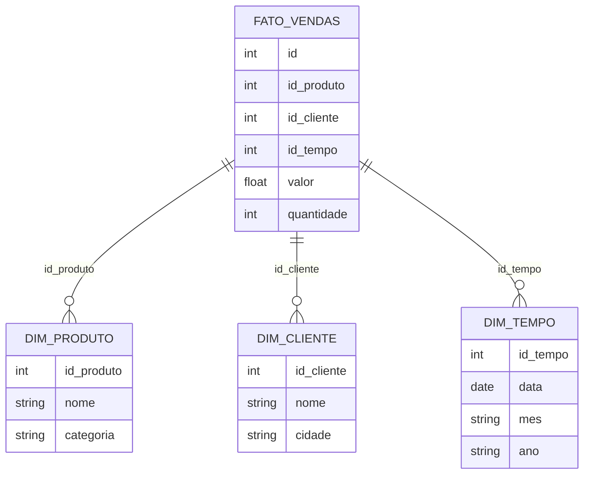

# Sistemas de Armazenamento e Entrega de Dados em Ambientes Analíticos Modernos
---

## Introdução

O cenário de engenharia de dados evoluiu rapidamente nos últimos anos, impulsionado pela necessidade de processar, armazenar e entregar grandes volumes de dados de forma eficiente, escalável e governada. Este documento detalha os principais conceitos, arquiteturas e práticas modernas para sistemas de armazenamento e entrega de dados, com foco em ambientes analíticos, Data Warehouses (DW), Data Lakes e Lakehouses, além de exemplos práticos utilizando PySpark.

---

## Event Hubs, Message Brokers e PubSub

**Event Hubs**, **Message Brokers** (como RabbitMQ, PubSub, Kafka) são sistemas responsáveis por intermediar o fluxo de dados entre aplicações, desacoplando produtores e consumidores. Eles garantem escalabilidade, resiliência e, em alguns casos, ordenação e entrega única das mensagens.

- **Event Hubs** (Azure): Focado em ingestão massiva de eventos.
- **PubSub** (Google): Sistema de publicação/assinatura, serverless.
- **RabbitMQ**: Message broker tradicional, com filas e tópicos.

> **Atenção:** Sistemas distribuídos podem gerar duplicidade de mensagens. O controle de duplicidade e ordenação é um desafio inerente, especialmente em arquiteturas globais.

---

## ETL vs ELT: Conceitos Fundamentais

### ETL (Extract, Transform, Load)

- **Extração**: Coleta dados de múltiplas fontes.
- **Transformação**: Limpeza, padronização e enriquecimento dos dados.
- **Carga**: Dados transformados são carregados no destino (geralmente um Data Warehouse).

### ELT (Extract, Load, Transform)

- **Extração**: Coleta dados de múltiplas fontes.
- **Carga**: Dados brutos são carregados diretamente no Data Lake.
- **Transformação**: As transformações são realizadas posteriormente, conforme a necessidade.

#### Diferenças e Aplicações

- **ETL** é tradicionalmente associado a Data Warehouses, onde o dado já chega transformado.
- **ELT** é mais comum em Data Lakes, permitindo flexibilidade e democratização do acesso ao dado bruto.

---

## Data Warehouse Tradicional (TDW) e Moderno (MDW)

### TDW (Traditional Data Warehouse)

- Centraliza dados de múltiplos sistemas transacionais.
- Utiliza modelagem dimensional (Star Schema, Snowflake).
- Foco em consultas analíticas, relatórios e BI.
- Exemplos: Oracle, SQL Server, Teradata.

### MDW (Modern Data Warehouse)

- Arquitetura cloud-native, escalável e elástica.
- Utiliza processamento massivo paralelo (MPP).
- Suporte a formatos colunar (Parquet, ORC).
- Exemplos: BigQuery (Google), Synapse Analytics (Azure), Redshift (AWS), Snowflake.

#### MPP (Massively Parallel Processing)

Permite processar grandes volumes de dados distribuindo tarefas entre múltiplos nós, acelerando consultas analíticas.

---

## Modelagem Dimensional: Star Schema

O **Star Schema** é um modelo de dados utilizado em Data Warehouses para otimizar consultas analíticas.

- **Tabela Fato**: Armazena métricas quantitativas (ex: vendas).
- **Tabelas Dimensão**: Armazenam atributos descritivos (ex: produto, cliente, tempo).



---

## Data Lake, Lakehouse e Camadas Bronze, Silver, Gold

### Data Lake

- Repositório centralizado de dados brutos, estruturados e não estruturados.
- Flexibilidade para ingestão de múltiplos formatos.

### Lakehouse

- Combina a flexibilidade do Data Lake com as garantias transacionais do Data Warehouse.
- Utiliza formatos como Delta Lake, Iceberg, Hudi.

### Camadas

- **Bronze**: Dados brutos, ingestão inicial.
- **Silver**: Dados limpos, tratados e padronizados.
- **Gold**: Dados prontos para consumo analítico, agregados e modelados.

---

## Entrega de Dados: Tabelas Gold e Estratégias

A camada **Gold** representa o dado pronto para consumo por áreas de negócio, BI, ciência de dados e sistemas externos.

### Estratégias de Entrega

- **Full Load**: Recria a tabela Gold periodicamente.
- **Incremental/Merge**: Atualiza apenas registros alterados ou novos.
- **Particionamento**: Otimiza consultas e escrita.

#### Exemplo PySpark: Criação de Tabela Gold

```python
# Supondo que já temos DataFrames silver_business, silver_user, silver_review

from pyspark.sql import functions as F

# Join para criar tabela Gold
df_gold = (
    silver_review
    .join(silver_business, "business_id")
    .join(silver_user, "user_id")
    .select(
        "review_id", "business_id", "user_id",
        "stars", "review_text",
        "business_name", "city", "state",
        "user_name", "user_importance"
    )
)

# Escrita particionada por user_importance
df_gold.write.format("delta") \
    .mode("overwrite") \
    .partitionBy("user_importance") \
    .save("/mnt/datalake/gold/reviews")
```

---

## Integração com Plataformas Analíticas

Após a criação da camada Gold, os dados podem ser consumidos por diferentes plataformas:

- **Synapse Analytics** (Azure)
- **BigQuery** (Google)
- **Redshift** (AWS)
- **Snowflake**
- **Power BI, Tableau, Looker**

### Exemplo: Escrevendo do PySpark para BigQuery

```python
df_gold.write.format("bigquery") \
    .option("table", "projeto.dataset.tabela_gold") \
    .mode("overwrite") \
    .save()
```

### Exemplo: Escrevendo do PySpark para Synapse Analytics

```python
df_gold.write \
    .format("com.databricks.spark.sqldw") \
    .option("url", "<SYNAPSE_CONNECTION_STRING>") \
    .option("dbtable", "dbo.tabela_gold") \
    .option("forwardSparkAzureStorageCredentials", "true") \
    .option("tempDir", "<AZURE_BLOB_TEMP_DIR>") \
    .mode("overwrite") \
    .save()
```

---

## Exemplos Práticos com PySpark

### Merge Incremental (Delta Lake)

```python
from delta.tables import DeltaTable

delta_gold = DeltaTable.forPath(spark, "/mnt/datalake/gold/reviews")

# DataFrame com novos dados
df_updates = ...

# Realiza o merge (upsert)
(
    delta_gold.alias("gold")
    .merge(
        df_updates.alias("updates"),
        "gold.review_id = updates.review_id"
    )
    .whenMatchedUpdateAll()
    .whenNotMatchedInsertAll()
    .execute()
)
```

### Consultas Otimizadas

- **Partition Pruning**: Consultas filtrando por colunas particionadas são mais rápidas.

```python
df = spark.read.format("delta").load("/mnt/datalake/gold/reviews")
df.filter(df.user_importance == "Rockstar").groupBy("city").count().show()
```

---

## Considerações Finais

- O processo de ingestão, tratamento e entrega é mais importante do que a tecnologia escolhida.
- Padronize a arquitetura: ingestão → bronze → silver → gold.
- Utilize modelagem dimensional para facilitar o consumo analítico.
- Escolha a plataforma de entrega (DW, Lakehouse, BI) conforme o perfil do consumidor.
- Automatize e otimize processos com particionamento, merge incremental e versionamento.
- Governança: controle de acesso, lineage e catálogo de dados são essenciais.

---

## Referências

- [Delta Lake Documentation](https://docs.delta.io/latest/)
- [PySpark Documentation](https://spark.apache.org/docs/latest/api/python/)
- [BigQuery Documentation](https://cloud.google.com/bigquery/docs)
- [Azure Synapse Analytics Documentation](https://docs.microsoft.com/azure/synapse-analytics/)
- [Snowflake Documentation](https://docs.snowflake.com/)

---

> **Dica:** Invista em fundamentos de arquitetura de dados, modelagem e processamento distribuído. O domínio desses conceitos permite transitar entre diferentes tecnologias e nuvens com facilidade.

